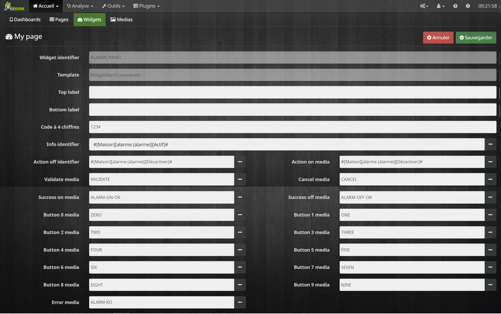

## Plugin Wall pour Jeedom

Ce plugin permet de configurer l'interface de votre Raspberry PI equipé d'un écran tactile pour interragir avec votre jeedom.

* [installation](docs/fr_FR/installation.md) 
* [documentation](docs/fr_FR/documentation.md) 
* [changelog](docs/fr_FR/changelog.md)

Quelques copies d'écran de la console:

Quelques copies d'écran de la configuration via le plugin jeedom:

   

