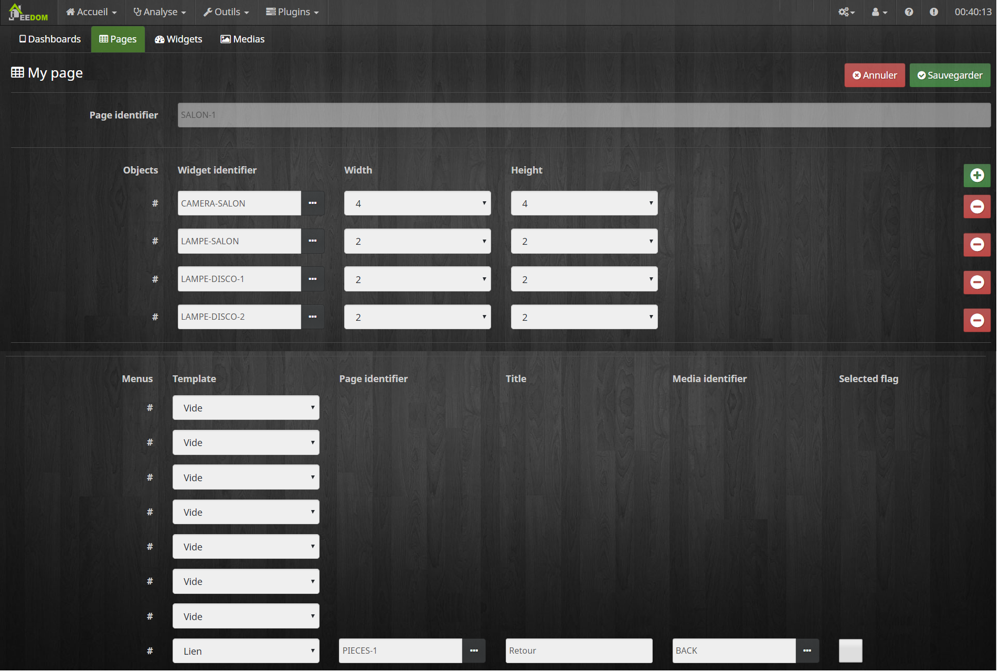

## Plugin Wall pour Jeedom

Ce plugin permet de configurer l'interface de votre Raspberry PI equipé d'un écran tactile pour interragir avec votre jeedom. La tablette est équipée d'un logiciel embarqué (code source angular) que je publierais prochainement. Le plugin jeedom permet de créer la conf du logiciel embarqué qui est lu au démarrage de celle-ci.

[Ecran tactile et boitier] (https://www.amazon.fr/gp/product/B01LZNCZ3A/ref=ppx_yo_dt_b_asin_title_o04__o00_s00?ie=UTF8&psc=1)

[Alimentation POE via le réseau] (https://www.amazon.fr/gp/product/B01H37XQP8/ref=ppx_yo_dt_b_asin_title_o04__o00_s01?ie=UTF8&psc=1)

* [installation](docs/fr_FR/installation.md) 
* [documentation](docs/fr_FR/documentation.md) 
* [changelog](docs/fr_FR/changelog.md)

## Quelques copies d'écran de la console que j'ai configuré chez moi pour les tests:

## Quelques copies d'écran du plugin jeedom permettant de configurer la console:

1) Configuration des dashoards:

2) Configuration des pages:

3) Configuration des pages:

4) Configuration des medias:

